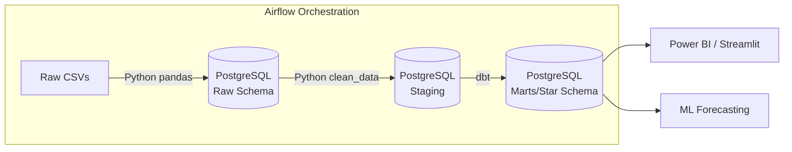

# End-to-End E-Commerce Analytics Platform 🛒📈


A production-grade, end-to-end data engineering and analytics pipeline. This project ingests raw e-commerce data, transforms it into a dimensional data warehouse, automates the pipeline with Airflow, models the data with dbt, forecasts sales using Machine Learning, and visualizes KPIs in an interactive dashboard.

---

## 🎯 Architecture



*(You can generate the full architecture PNG by running `python docs/architecture_diagram.py`)*

## 🚀 How to Run the Project

### 1. Prerequisites
- Docker & Docker Compose installed
- Python 3.9+ installed

### 2. Start the Infrastructure (Database & Airflow)
```bash
# Clone the repository
cd ecommerce-analytics

# Start PostgreSQL and Airflow via Docker
docker-compose up -d
```

### 3. Setup Python Environment
```bash
python -m venv venv
# Windows: venv\Scripts\activate
# Mac/Linux: source venv/bin/activate

pip install -r requirements.txt
```

### 4. Run the Pipeline

**Step A: Generate Data & Load to Staging**
```bash
# 1. Generate synthetic dataset
python python/ingest/generate_dataset.py

# 2. Load into PostgreSQL (raw schema)
python python/ingest/load_raw.py

# 3. Clean and load to staging schema
python python/transform/clean_data.py
```
*(Note: These steps are also automated via the Apache Airflow DAG! Go to `http://localhost:8080` (admin/admin123) to trigger them visually).*

**Step B: Data Modeling with dbt**
```bash
cd dbt
dbt deps
dbt run --profiles-dir .
dbt test --profiles-dir .
dbt docs generate --profiles-dir .
dbt docs serve --profiles-dir .  # Opens the data catalog in your browser
```

**Step C: Machine Learning Forecasting**
```bash
# Train the model
python python/ml/train_model.py

# Evaluate the model (generates plot in docs/)
python python/ml/evaluate_model.py
```
*(Explore the thought process in `notebooks/ml_forecasting.ipynb`)*

**Step D: Launch the Dashboard**
```bash
streamlit run dashboard/streamlit_app.py
```
*(Or follow `dashboard/powerbi/README.md` to connect Power BI)*

---

## 📁 Repository Structure

- `/airflow/` - Apache Airflow DAGs for ETL orchestration
- `/data/` - Raw synthetic CSV datasets (generated dynamically)
- `/database/` - PostgreSQL schema definitions
- `/dbt/` - dbt models (Staging & Marts), tests, and configuration
- `/python/` - Python scripts for ingestion, cleaning, and ML training
- `/sql/` - 10 Advanced SQL queries for analytical reporting
- `/dashboard/` - Streamlit app and Power BI connection guide
- `/notebooks/` - Jupyter notebooks for exploratory data analysis
- `/docs/` - Architecture diagrams and model evaluation plots
- `/tests/` - Pytest unit tests for data cleaning logic

---

## 💼 Resume Description (For Portfolio)
> **E-Commerce Data Platform** | *Python, PostgreSQL, Airflow, dbt, Scikit-learn, Docker*
> - Built an end-to-end data pipeline processing e-commerce transactions from raw CSV ingestion into a normalized PostgreSQL data warehouse.
> - Automated daily ETL workflows using Apache Airflow DAGs with retry logic and data quality gates.
> - Designed a dimensional data model (Star Schema) using dbt, implementing incremental loading for fact tables and comprehensive data testing.
> - Engineered a Random Forest machine learning model to forecast daily sales, achieving high accuracy by leveraging time-series lag features.
> - Developed interactive dashboards to visualize KPIs, cohort retention, and geographic sales distribution.
